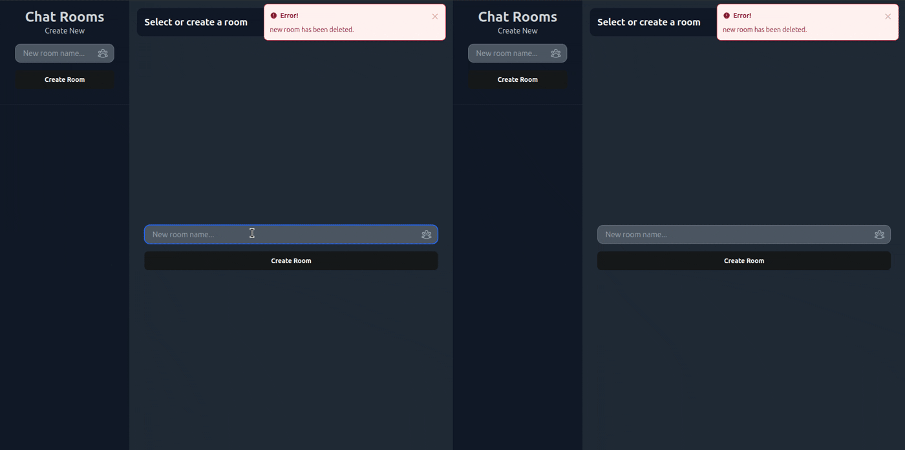

The new one

# Phoenix LiveView 1.0 Multi Chatroom App Tutorial


A complete Phoenix LiveView (~> 1.0) tutorial to build a chatroom app where users can _create_, _update_, and _delete_ both chatrooms and messages **all in real time.**

## Preview



## Table of Contents

- [**Intro**](#what-we-will-build)

  - [Preview](#project-overview)
  - [Table of Contents](#table-of-contents)

- [**Project Overview**](#project-overview)

  - [Who is this for?](#who-is-this-for)
  - [Prerequisites](#prerequisites)
  - [Concepts Covered](#liveview-concepts-covered)
  - [Concepts **Not** Covered](#liveview-concepts-not-covered)

- [**Tutorial**](#2-create-the-database)

  - [1. Creating the database](#2-create-the-database)
  - [2. Adding the templates](#2-building-templates-using-components)
  - [3. Creating the room list](#2-create-the-database)
  - [4. Creating the room form](#2-create-the-database)
  - [5. Live updating the room list using PubSub ](#2-create-the-database)
  - [6. Paginating the room list with PubSub ](#2-create-the-database)
  - [7. Deleting and updating rooms ](#2-create-the-database)
  - [8. Creating the message component ](#2-create-the-database)
  - [9. Showing users online with Presence ](#2-create-the-database)
  - [10. **BONUS:** Show users typing with JavaScript Hooks ](#2-create-the-database)

- [**Next Steps**](#2-create-the-database)
  - [Improvement Ideas](#2-create-the-database)
  - [Other Tutorials](#2-create-the-database)
  - [Contacts](#2-create-the-database)
  - [Credits](#2-create-the-database)

# Project Overview

You will build a multi chatroom app using the most powerful LiveView features in this tutorial. Users will be able to create their own room and change the room name in realtime, with the change being instantly sent to anyone in the room. Users may delete chatrooms which will redirect everyone in the room with a message saying the room was deleted.

users may send, update, and delete messages in real time inside a room. Users can seamlessly navigate between two chatrooms using live patching.

## Who is this for?

This project is great for **all skill levels**. _Beginners_ will learn the most powerful LiveView features and apply them in a moderately complex app. _Intermediate_ and _advanced_ Elixir programmers may reference this book for up-to-date LiveView (~> 1.0) code for topics inside [Concepts Covered](#concepts-covered) section.

## Prerequisites

You should be familiar with the Elixir language as concepts like piping and pattern matching are heavily used. A basic understanding of Phoenix and LiveView is suggested as I will gloss over some details.

JavaScript is **NOT** required! There is no JavaScript throughout this course until the bonus section at the end. The bonus uses JavaScript, but it is an optional minor feature (shows how many users are typing).

## Concepts Covered

- Ecto Associations
- Ecto Queries
- Changesets
- Components
- Live Components
- JavaScript Commands (this is writen in Elixir)
- LiveView forms with associations
- LiveView Streams
- Phoenix PubSub for creating, updating, and deleting records
- Phoenix Presence for user tracking
- Patching properly with PubSub and Presence
- JavaScript Hooks
- Best Elixir Practices

## Concepts **NOT** Covered

This tutorial focuses on realtime liveview features over backend logic. Therefore, there will not be authentication or permission logic. I do not cover testing either. I may make a tutorial with these features if this tutorial does well so star this repo!

# **Tutorial**

## 1. Creating the database

Open the directory for the project and run the following command (I recommend using the same project name):

```
mix phx.new chatroom_tutorial
# Press y and install all packages, or later run mix deps.
cd ./chatroom_tutorial
# Now open the project
```

Make sure Postgres and ecto are set up properly on your computer before continuing. More can be found here:

https://hexdocs.pm/ecto/getting-started.html

We will use generator commands to make the structure of the message and room records. You can find a list of generator commands by typing `mix phx.gen` and pressing `ENTER`.

You will get text that looks like this:

```
mix phx.gen.auth     # Generates authentication logic for a resource
mix phx.gen.cert     # Generates a self-signed certificate for HTTPS testing
mix phx.gen.channel  # Generates a Phoenix channel
mix phx.gen.context  # Generates a context with functions around an Ecto schema
mix phx.gen.embedded # Generates an embedded Ecto schema file
mix phx.gen.html     # Generates context and controller for an HTML resource
mix phx.gen.json     # Generates context and controller for a JSON resource
mix phx.gen.live     # Generates LiveView, templates, and context for a resource
mix phx.gen.notifier # Generates a notifier that delivers emails by default
mix phx.gen.presence # Generates a Presence tracker
mix phx.gen.release  # Generates release files and optional Dockerfile for release-based deployments
mix phx.gen.schema   # Generates an Ecto schema and migration file
mix phx.gen.secret   # Generates a secret
mix phx.gen.socket   # Generates a Phoenix socket handler
```

We will use the Context generator because this will generate both a database structure and an API for us to interact with. There are other options such as HTML or LIVE, but we will write the web part manually. Entering `mix phx.gen.context` in the command line will show an example command.

Now it is time to build with generators. Type the following commands:

```
mix phx.gen.context Chatroom Message messages username:string text:string

mix phx.gen.context Chatroom Room rooms name:string
# You will get a warning, but since they are closely related we will put them in the same context. Press Y
```

This creates migration files under priv/repo/migrations, a "chatroom" api that handles message and room records, and a schema file that ecto the database manager will use to validate if there are correct fields for a database.

All database and business logic should be put inside "lib/chatroom_tutorial". HTML and UI logic managed inside of "lib/chatroom_tutorial_web". Modules inside chatroom_tutorial_web will use chatroom_tutorial functions for getting records, but the chatroom_tutorial will never access chatroom_tutorial_web functions.

Now it is time to setup the database. Run the following commands to set up the database.

```
mix ecto.create
# If this does not work properly, you must setup Postgres and Ecto!
mix ecto.migrate

# OR... you can run this command which runs both setup and migrate
mix ecto.setup
```

The only command you ever need to memorize is `mix ecto`. This will display all commands inside ecto. Same is true with `mix phx` for listing all "Phoenix" related commands.

Migration files are used to build the database. They are separated into different elixir files, and always contain a timestamp when created. You can find these files in `priv/repo/migrations/`. These commands determine fields that get put into the database and their associations.

The database is built step by step like an instruction book, and every migration file being one step. Migrations steps completed by the database are considered "up", while steps not yet built are "down". You can see which 'step' the file is on with the command `mix ecto.migrations`. The command `mix ecto.migrate` is used to move up a migration (step in the instruction book), and the command `mix ecto.rollback` is used to reverse a change made (undo a step).

Migration files act both as a construction and "disassembly" book for the database. It is important to never modify a migration that is 'up' because ecto considers that step built, and migrating will not add the new field. Furthermore, rolling back to a modified migration will cause an error because it expects to remove a feature that has not been built!

You can reset your database with `mix ecto.drop` and call `mix ecto.setup` if accidentally modifying a migration file that is `up`. _only do this when the database data is not important!_ Otherwise go back to a previous version of the code.

There are two main ways to add database changes without resetting. One way is to rollback to the migration file, make changes, and push it back `up`. This strategy is only good for modifying recent mistakes like typos or forgetting to add a field. Only do this for very recent mistakes where no team member has access to this migration file.

The better way to make changes is by creating a new migration file. This is done with the command `mix ecto.gen.migration your_migration_name_here`. This generates a new migration file in the `priv/repo/migrations` directory. The new file name has a timestamp in front followed by the name you provided.

Next we will create a many to one relationship between the messages and rooms. Call the command:

```
mix ecto.gen.migration create_room_messages_association
```

Open the migration file and write the following code out:

```
defmodule ChatroomTutorial.Repo.Migrations.CreateRoomMessagesAssociation do
  use Ecto.Migration

  def change do

    alter table(:messages) do
      add :room_id, references(:rooms, on_delete: :delete_all), null: false
    end

    create unique_index(:rooms, [:name])
    create index(:messages, [:room_id])

  end
end
```

The `alter table(:messages)` command allows you to `add` and `remove` fields of a type of record within the `do ... end` block. We add a mandatory room_id field to the messages table that references a room.

We make every name field in rooms unique with the command `create unique_index(:rooms, [:name])`. We also make identifying messages by `room_id` faster for the database with the command `create index(:messages, [:room_id])`.

Now our migration file is ready! Call the this familiar command again to put the new migration `up`!

`mix ecto.migrate`

Now the database is configured correctly, but our schemas and validation logic is outdated. We change this by modifying the `message` and `room` files inside the `lib/chatroom_tutorial/chatroom` directory.

Inside the `lib/chatroom_tutorial/chatroom/room` directory, add the following line:

```
schema "rooms" do
  field :name, :string
  # Add this line vvv
  has_many :messages, ChatroomTutorial.Chatroom.Message

  timestamps(type: :utc_datetime)
end
```

This lets ecto know rooms will have many messages and gives access to many convienient functions when verifying data.

Lets do the same for message records in `lib/chatroom_tutorial/chatroom/message`:

```
schema "messages" do
  field :text, :string
  field :username, :string
  # Add this line vvv
  belongs_to :room, ChatroomTutorial.Chatroom.Room

  timestamps(type: :utc_datetime)
end
```

The `belongs_to` automatically knows that there will be a field named `room_id` inside the messages component. However, this requires the field name in the migration file to exactly be room_id. This default behavior can be changed with the `:foreign_key` option which may be necessary in more complex schemas. This is shown in the ecto documentation when they say:

```
:foreign_key - Sets the foreign key field name, defaults to the name of the association suffixed by _id. For example, belongs_to :company will define foreign key of :company_id. The associated has_one or has_many field in the other schema should also have its :foreign_key option set with the same value.
```

_Learn more:_ https://hexdocs.pm/ecto/Ecto.Schema.html#belongs_to/3

Now that the fields are properly set, we must properly set up the constraints when validating. Modify the changeset function inside of `lib/chatroom_tutorial/chatroom/message` to the following:

```
def changeset(message, attrs) do
    message
    |> cast(attrs, [:username, :text, :room_id])
    |> validate_required([:username, :text, :room_id])
    |> validate_length(:username, min: 4, max: 20)
    |> validate_length(:text, min: 2, max: 150)
    |> assoc_constraint(:room)
  end
```

Changeset functions basically go through a series of tests to make sure the data is correct. There is a value in the changeset object called `valid?` that is true by default and set false when one test is failed.

The `cast/3` function lists all the possible fields that will be assigned to a new changeset, and returns a changeset object. All values outside of the list will not be ignored. `validate_required` makes the names listed inside the array mandatory for the changeset to succeed. The `assoc_constraint` makes sure the room is connected properly. `validate_length` ensures the string size is between the range of values you set.

You can find more types of changeset validation functions here: https://hexdocs.pm/ecto/Ecto.Changeset.html#functions

Now modify the changeset function inside `lib/chatroom_tutorial/chatroom/room`:

```
def changeset(room, attrs) do
  room
  |> cast(attrs, [:name])
  |> validate_required([:name])
  |> unique_constraint(:name)
end
```

Now both the database and validation logic is set up. The last thing to do is to ge thte API to get certain values. We do not need to change the update/create functions since we demand a :room_id within our changeset and check if it exists. Our create_room and create_message functions take a map of the new records fields and push them into a changeset. This means the API for create and update remains the same since :room_id is just another field in the map.

Before we add functions to get messages based on associations, we will create query functions to make fetching values extremely easy. Create a new file called `room_query.ex` in the `lib/chatroom_tutorial/chatroom/` directory, and and the following:

```
defmodule ChatroomTutorial.Chatroom.RoomQuery do
  import Ecto.Query

  def rooms() do
    from r in ChatroomTutorial.Chatroom.Room,
      order_by: [asc: r.inserted_at]
  end

  def limit(query, limit) do
    from q in query, limit: ^limit
  end

  def after_timestamp(query, nil), do: query

  def after_timestamp(query, after_timestamp) do
    from q in query, where: q.inserted_at > ^after_timestamp
  end

  def with_messages(query) do
    from q in query,
      preload: :messages
  end
end

```

Ecto allows us to break up queries into functions and chain them together instead of creating one giant query function for each call. This makes for very readable code when piping.

The `rooms/0` is the only function that creates the query in this module. All the other functions will modify this original query. We order all the chatrooms by when they were inserted by default. We can can modify this base query by passing it through functions written in this module.

Now make a file in `lib/chatroom_tutorial/chatroom/message_query.ex` and write the following:

```
defmodule ChatroomTutorial.Chatroom.MessageQuery do
  import Ecto.Query


  def messages() do
    from m in ChatroomTutorial.Chatroom.Message,
      order_by: [desc: m.inserted_at]
  end

  def limit(query, limit \\ 30) do
    from q in query,
      limit: ^limit
  end

  def before(query, before_timestamp) when is_nil(before_timestamp), do: query

  def before(query, before_timestamp) do
    from q in query,
      where: q.inserted_at < ^before_timestamp
  end

  def from_room(query, room_id) do
    from q in query,
      where: q.room_id == ^room_id
  end

  def from_username(query, username) do
    from q in query,
      where: q.username == ^username
  end
end
```

Now lets put these into our API. First open `lib/chatroom_tutorial/chatroom.ex` and alias our new modules at the top of the function:

```
alias ChatroomTutorial.Chatroom.MessageQuery
alias ChatroomTutorial.Chatroom.RoomQuery
```

Replace all `Message` that are parameters of repo with `MessageQuery.messages()` for consistency. Also change `list_messages/0` to `list_all_messages/0` as we will have more specific functions in the future. The new function looks like this:

```
# Remove the `list_messages/0` function and replace with this one
def list_all_messages do
  MessageQuery.messages()
  |> Repo.all()
end
```

Now we will add two more functions for getting multiple messages. Put them right underneath `list_all_messages/0`:

```
def list_all_messages_from_room(room_id) do
  MessageQuery.messages()
  |> MessageQuery.from_room(room_id)
  |> Repo.all()
end

def list_messages_from_room(room_id, before_timestamp \\ nil) do
  MessageQuery.messages()
  |> MessageQuery.from_room(room_id)
  |> MessageQuery.limit(30)
  |> MessageQuery.before(before_timestamp)
  |> Repo.all()
  |> Enum.reverse()
end
```

The first function lists every message from a given room with no pagination. The other function will get 30 message records before a given timestamp and reverse the order after all messages are received. Having a dedicated query module with composable functions makes code far more readable.

Now do the same for `Room` functions. Remove the default `list_rooms/0` function, and put these new functions where you deleted it.

```
def list_all_rooms do
  RoomQuery.rooms()
  |> Repo.all()
end

def list_rooms(after_timestamp \\ nil) do
  RoomQuery.rooms()
  |> RoomQuery.limit(30)
  |> RoomQuery.after_timestamp(after_timestamp)
  |> Repo.all()
end
```

Now lets get rid of the magic pagination numbers with a module variable:

```
# Add near the top...
@query_limit 30

# Add beneath. Useful for accessing this variable outside of the module
def get_query_limit(), do: @query_limit

# Replace number 30 with @query_limit in `list_messages_from_room` function
|> MessageQuery.limit(@query_limit)

# And replace 30 with @query_limit in `list_rooms` function
|> RoomsQuery.limit(@query_limit)
```

No associations will be loaded by default when getting a record, and you must manually demand an association to load. This process is called `proloading` in ecto. This is a performance feature to prevent database calls from getting out of hand. One way of preloading messages from rooms is with a query and the `:preload` option in query.

The preload function was added in `with_messages` in our `RoomQuery` module. Find the `get_room!` function in `Chatrooms` and replace it with the following, and add a function to preload a rooms messages:

```
def get_room!(id) do
  RoomQuery.rooms()
  |> Repo.get!(id)
end

def get_room_with_messages!(id) do
  RoomQuery.rooms()
  |> RoomQuery.with_messages()
  |> Repo.get!(id)
end
```

`get_room!/1` will only fetch a room with no associated messages, while `get_room_with_messages!/1` will fetch messages due to the `with_messages/1` function preloading a all messages.

WIP!!! - Coming soon!

You can go ahead and look at the complete source code here:
https://github.com/BrianHammer/phoenix-liveview-chatrooms

# Next Steps

## Improvement Ideas

Here are some ideas to exand and improve the app once the tutorial is finished. Some of these concepts were overlooked to keep things simpler. Other ideas are a rough roadmap for exanding this app.

### Refactor LiveComponents:

The LiveComponents are tightly coupled to the API and could be refactored. Many variables are passed into these components to make the functions work. It is recommended to refactor the code to use function callbacks according to the LiveView documentation. Doing so will make your components more reusable and easier to maintain.

Learn more about this here: https://hexdocs.pm/phoenix_live_view/Phoenix.LiveComponent.html

### Integrate async result:

Loading database records may take a while to fetch. This halts the liveview from returning a response as it waits for the database call. Furthermore, database records will load one after another when they could be called at the same time! LiveView's AsyncResult fixes both these issues by loading messages and room records at the same time and giving an option to display a loading state as ecto fetches the records to be loaded. Integrating this feature makes the app even faster and give the users a better UX (user experience).

Learn more about this here: https://hexdocs.pm/phoenix_live_view/Phoenix.LiveView.AsyncResult.html

### Add Authentication:

The the most obvious missing feature, so here is rough roadmap of how to build it. Phoenix has great options for authentication, with the simplest being `mix phx.gen.auth` generator. Start by intergrating the login/signup page, and eventually completely replace the `username` from the messages schema with a `user_id` association.

Next, learn how to integrate authentication in a LiveView with the links below. Remove the "username" input field with a hidden input connected to the current `user_id`. Adjust the messages query to include the username since messages no longer has the `username` field. Finally, replace `socket.id` as the presence_id with the logged in `user.id` to list logged in users rather than how many tabs are open. You can also make a list of users on the page using Presence and put it to the right.

**Learn more:**

_Phoenix auth generator:_ https://hexdocs.pm/phoenix/mix_phx_gen_auth.html

_Authetnication combined with LiveView:_ https://hexdocs.pm/phoenix_live_view/security-model.html

### Add Profile Images

Add a custom modal using phoenix liveview's modal component under 'CoreComponents' for editing user and room settings. This model can change the users username, and will replace the room buttons 'edit name' feature. Then have it so the room and user all have a avatar image. I recommend using the 'Uploads' feature for this.

Learn More: https://hexdocs.pm/phoenix_live_view/uploads.html

### Add Authorization / Basic User Permissions:

_ONLY DO AFTER ADDING AUTHENTICATION LISTED ABOVE!_

Now that you have authentication, you can make sure users can only delete their own posts and rooms! Make it so the edit/delete buttons in messages are listed only for their own posts with a simple `:if={...your logic here}` comparison. You can also add a ownership to rooms with associations between the user and room, and only display edit/delete commands for the owner.

Be sure to also check for permissions when submitting the forms. Make sure the hidden input for `user_id` matches what liveviews `user_id` when submitting a form (if you choose to use a hidden input), otherwise your app is easily hackable! You can also make it so the owner may delete any comments by adding extra logic.

### Add Advanced / Role Permissions and Private Rooms

_ONLY DO AFTER ADDING THE LAST TWO IMPROVEMENTS! (AUTHENTICATION AND AUTHORIZATION)_

Complex Authorization can get tough to manage, especially with roles. Consider using a library like Pow or Guardian to manage permissions. You will need a new record called "permissions" with a many-to-many relationship between rooms and users to create private rooms. Each user_id and room_id combination must be unique, and it will need a "role" field for user role in that specific room to include permissions.

The 'owner' field room can be removed and replaced with a permission record for a more robust system (ex. if a user deletes their account, go through all permissions where they are the owner and assign a new owner).

Users can join via invite links similar to Discord. This record would be associated to the room, and when a logged in user opens the link they immediately get a guest role permission created for that room.

## Other Tutorials


## Contacts

Email: Brianhammer4work@gmail.com

## Credits

- Tailwind Chatroom Template by Saim Ansari
  - [larainfo.com/blogs/tailwind-css-chat-ui-example/](https://larainfo.com/blogs/tailwind-css-chat-ui-example/)
